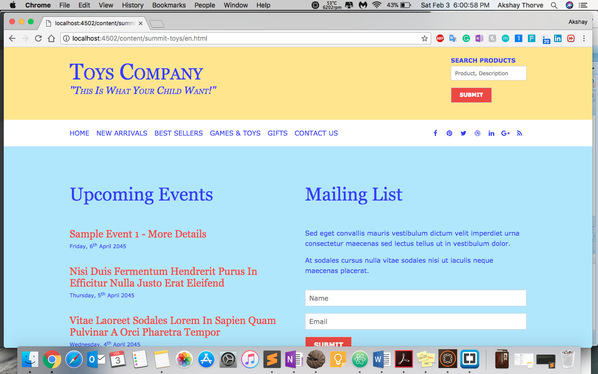
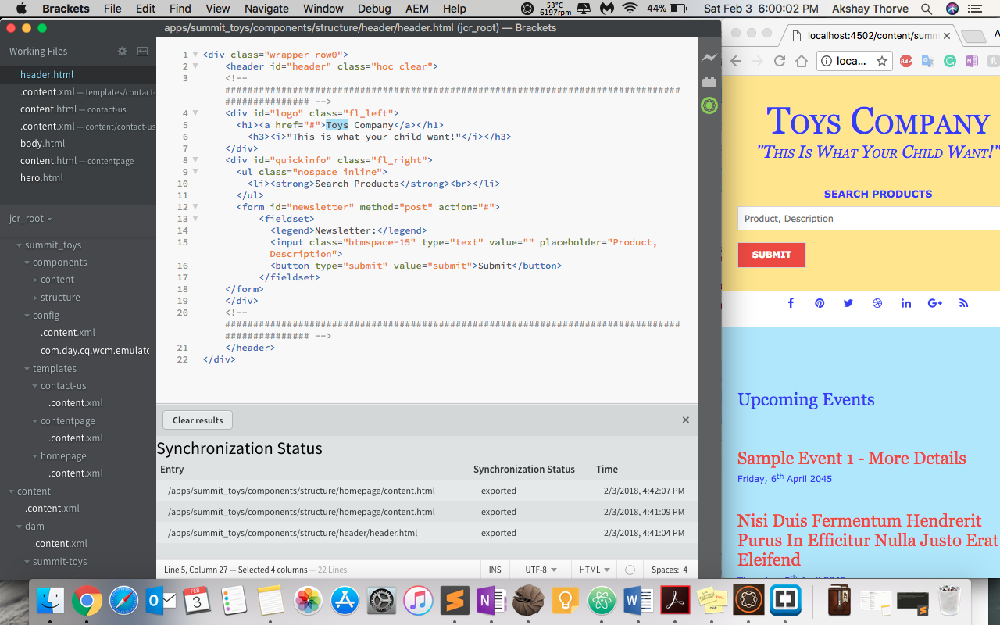
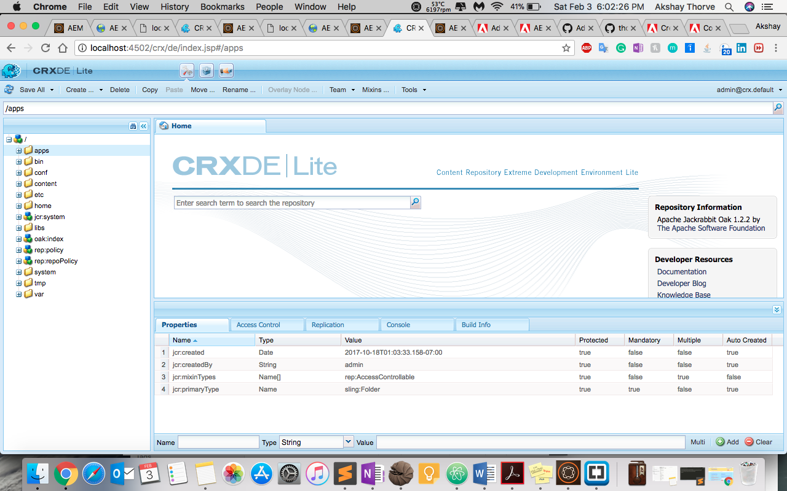

# AEM Toys Store Website

## Adobe Experience Manager 6.3 website

Creating demo website in AEM 6.3 to revise the AEM basic concepts


### Prerequisites

What things you need to install the software and how to install them

```
AEM 6.0 +
```

### Snapshots

```
Website UI
```


```
Bracket Editor + AEM + Synchronization 
```


```
CRXDE|Lite Setup
```



## Getting Started

These instructions will get you a copy of the project up and running on your local machine for development and testing purposes.

* Download this git source code as zip.
* Upload zip to http://localhost:4502/crx/packmgr/index.jsp packages
* Install the package
* Refresh your page.
* Navigate to localhost:4502/content/summit-toys/en.html


## Built With

* [AEM](https://www.adobe.com/marketing-cloud/experience-manager.html) - The web framework used


## Credits and Acknowledgments

* The code used in this demo website is based on code created by Adobe employee Dennis selfridge. Thank you Dennis!  
* Website: https://helpx.adobe.com/experience-manager/using/first_aem63_website.html
* Tutorial: https://www.youtube.com/watch?v=RTtudQ-YSBw&t=7s
